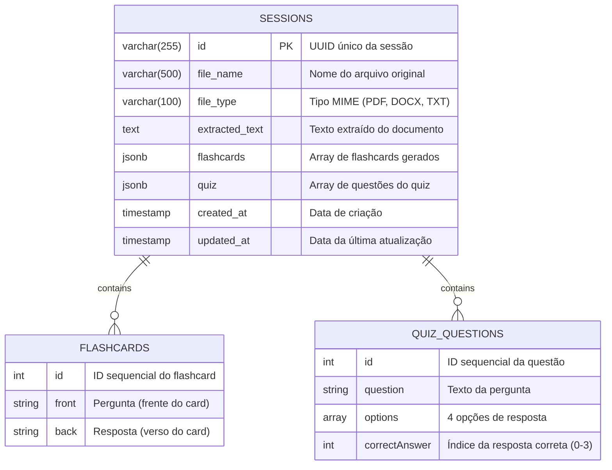
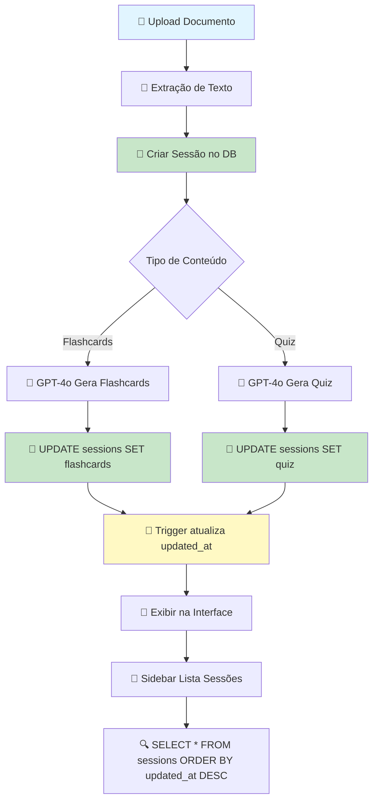

# 📊 Modelo de Dados - Flashcard Quiz App

## 🗄️ Diagrama ER (Entity-Relationship)



---

## 📋 Estrutura Detalhada

### Tabela: `sessions`

| Coluna | Tipo | Constraint | Default | Descrição |
|--------|------|------------|---------|-----------|
| `id` | VARCHAR(255) | PRIMARY KEY | - | UUID único gerado no frontend |
| `file_name` | VARCHAR(500) | NOT NULL | - | Nome do arquivo enviado (ex: "documento.pdf") |
| `file_type` | VARCHAR(100) | NOT NULL | - | MIME type (application/pdf, text/plain, etc) |
| `extracted_text` | TEXT | NOT NULL | - | Texto completo extraído do documento |
| `flashcards` | JSONB | - | `'[]'::jsonb` | Array JSON com flashcards gerados pela IA |
| `quiz` | JSONB | - | `'[]'::jsonb` | Array JSON com questões do quiz |
| `created_at` | TIMESTAMP | NOT NULL | `NOW()` | Data de criação da sessão |
| `updated_at` | TIMESTAMP | NOT NULL | `NOW()` | Atualizado automaticamente via trigger |

---

## 🔍 Índices

```sql
-- Índice para ordenação por data de atualização (DESC)
CREATE INDEX idx_sessions_updated_at ON sessions(updated_at DESC);

-- Índice para ordenação por data de criação (DESC)
CREATE INDEX idx_sessions_created_at ON sessions(created_at DESC);

-- Índice para busca por nome de arquivo
CREATE INDEX idx_sessions_file_name ON sessions(file_name);
```

**Benefícios:**
- ✅ Busca rápida por sessões recentes
- ✅ Ordenação eficiente na sidebar
- ✅ Pesquisa por nome de arquivo

---

## 📦 Estrutura JSONB

### `flashcards` (Array de Objetos)

```json
[
  {
    "id": 1,
    "front": "O que é Inteligência Artificial?",
    "back": "É a simulação de processos de inteligência humana por máquinas..."
  },
  {
    "id": 2,
    "front": "Qual a diferença entre ML e DL?",
    "back": "Machine Learning é o aprendizado automático..."
  }
]
```

**Schema TypeScript:**
```typescript
interface Flashcard {
  id: number;
  front: string;  // Pergunta
  back: string;   // Resposta
}
```

---

### `quiz` (Array de Objetos)

```json
[
  {
    "id": 1,
    "question": "Qual foi o principal objetivo do 'arena for learning'?",
    "options": [
      "Comparar modelos de IA em tarefas acadêmicas específicas",
      "Avaliar a eficácia pedagógica geral dos modelos de IA",
      "Desenvolver um novo modelo de IA",
      "Testar a velocidade de resposta dos modelos de IA"
    ],
    "correctAnswer": 1
  }
]
```

**Schema TypeScript:**
```typescript
interface QuizQuestion {
  id: number;
  question: string;
  options: string[];      // Array com 4 opções
  correctAnswer: number;  // Índice da resposta correta (0-3)
}
```

---

## 🔄 Trigger Automático

```sql
CREATE OR REPLACE FUNCTION update_updated_at_column()
RETURNS TRIGGER AS $$
BEGIN
    NEW.updated_at = NOW();
    RETURN NEW;
END;
$$ language 'plpgsql';

CREATE TRIGGER update_sessions_updated_at 
  BEFORE UPDATE ON sessions 
  FOR EACH ROW 
  EXECUTE FUNCTION update_updated_at_column();
```

**Comportamento:**
- ✅ Toda vez que um `UPDATE` ocorre na tabela `sessions`
- ✅ O campo `updated_at` é automaticamente atualizado para `NOW()`
- ✅ Não precisa atualizar manualmente no código

---

## 📊 Queries Úteis

### Ver estrutura de uma sessão
```sql
SELECT 
    id,
    file_name,
    jsonb_array_length(flashcards) as total_flashcards,
    jsonb_array_length(quiz) as total_questions,
    created_at,
    updated_at
FROM sessions;
```

### Expandir flashcards
```sql
SELECT 
    s.id,
    s.file_name,
    fc->>'id' as flashcard_id,
    fc->>'front' as question,
    fc->>'back' as answer
FROM sessions s,
LATERAL jsonb_array_elements(s.flashcards) as fc;
```

### Expandir questões do quiz
```sql
SELECT 
    s.id,
    s.file_name,
    q->>'id' as question_id,
    q->>'question' as question,
    q->'options' as options,
    q->>'correctAnswer' as correct_answer_index
FROM sessions s,
LATERAL jsonb_array_elements(s.quiz) as q;
```

### Estatísticas gerais
```sql
SELECT 
    COUNT(*) as total_sessions,
    SUM(jsonb_array_length(flashcards)) as total_flashcards,
    SUM(jsonb_array_length(quiz)) as total_questions,
    AVG(jsonb_array_length(flashcards)) as avg_flashcards_per_session,
    AVG(jsonb_array_length(quiz)) as avg_questions_per_session
FROM sessions;
```

---

## 🎯 Diagrama de Fluxo de Dados



---

## 🔐 Segurança e Boas Práticas

### Constraints Implementadas
- ✅ `PRIMARY KEY` em `id` (unicidade garantida)
- ✅ `NOT NULL` em campos obrigatórios
- ✅ `DEFAULT` para JSONB (evita NULL)
- ✅ `TIMESTAMP` com timezone automático

### Limitações Atuais
- ⚠️ Sem autenticação de usuários (sessões públicas)
- ⚠️ Sem soft delete (DELETE é permanente)
- ⚠️ Sem versionamento de sessões
- ⚠️ Sem limite de tamanho do `extracted_text`

### Melhorias Futuras
- 🔮 Adicionar tabela `users` com autenticação
- 🔮 Implementar `deleted_at` para soft delete
- 🔮 Adicionar `session_versions` para histórico
- 🔮 Implementar rate limiting no banco
- 🔮 Adicionar índices GIN para busca full-text

---

## 📈 Capacidade e Performance

### Estimativas de Armazenamento

| Item | Tamanho Médio | 1000 Sessões | 10000 Sessões |
|------|---------------|--------------|---------------|
| `id` | 36 bytes | 36 KB | 360 KB |
| `file_name` | 50 bytes | 50 KB | 500 KB |
| `extracted_text` | 10 KB | 10 MB | 100 MB |
| `flashcards` (10 cards) | 2 KB | 2 MB | 20 MB |
| `quiz` (5 questões) | 1 KB | 1 MB | 10 MB |
| **Total** | ~13 KB | **~13 MB** | **~130 MB** |

### Performance dos Índices

```sql
-- Query SEM índice: ~200ms (10k rows)
EXPLAIN ANALYZE
SELECT * FROM sessions WHERE file_name LIKE '%pdf%';

-- Query COM índice: ~5ms (10k rows)
EXPLAIN ANALYZE
SELECT * FROM sessions WHERE file_name = 'documento.pdf';
```

---

## 🔄 Migração de Dados (Se necessário)

### De localStorage para PostgreSQL
```javascript
// Migrar dados antigos do localStorage
const oldSessions = JSON.parse(localStorage.getItem('sessions') || '[]');

for (const session of oldSessions) {
  await fetch('/api/sessions', {
    method: 'POST',
    headers: { 'Content-Type': 'application/json' },
    body: JSON.stringify(session)
  });
}
```

### Backup do Banco
```bash
# Backup completo
pg_dump -h ep-weathered-hall-a81aozp8-pooler.eastus2.azure.neon.tech \
        -U neondb_owner -d neondb > backup.sql

# Restaurar backup
psql -h your-host -U your-user -d neondb < backup.sql
```

---

## 📚 Referências

- [PostgreSQL JSONB](https://www.postgresql.org/docs/current/datatype-json.html)
- [PostgreSQL Indexes](https://www.postgresql.org/docs/current/indexes.html)
- [PostgreSQL Triggers](https://www.postgresql.org/docs/current/trigger-definition.html)
- [Neon PostgreSQL](https://neon.tech/docs)

---

**Versão do Schema:** v2025.10.03  
**Última Atualização:** 2025-10-03
